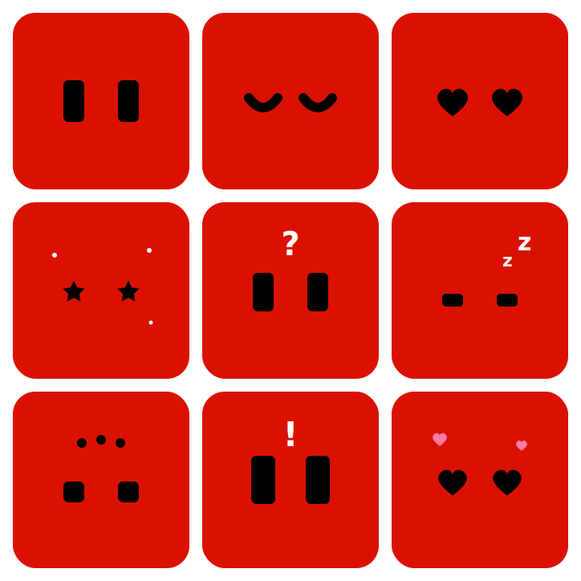
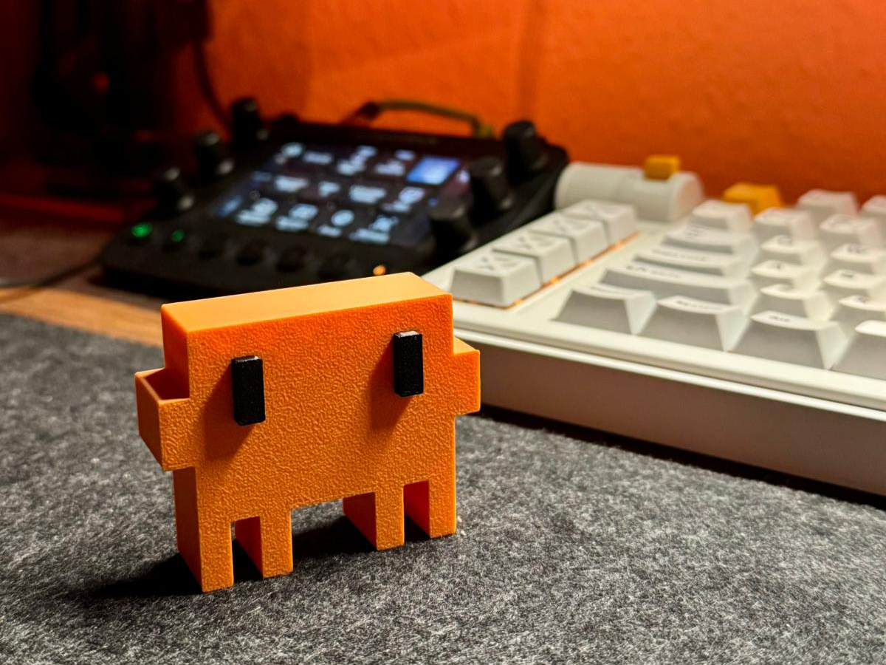

<p align="center">
  
</p>

<h1 align="center">Clawd Mood</h1>

<p align="center">
  
  
  
</p>

<p align="center"><a href="README.md">简体中文</a> · <b>English</b></p>

<p align="center">
  
</p>
<p align="center"><sub>The device's actual expressions (normal / happy / heart / sparkle / curious / sleepy / thinking / surprised / love)</sub></p>

> An independent fan project, not officially affiliated with Anthropic. "Claude" and "Clawd" are trademarks of Anthropic.
>
> Built on top of the open-source project **[yousifamanuel/clawd-mochi](https://github.com/yousifamanuel/clawd-mochi)** — the firmware (eye-rig engine, emotion engine, semantic monitoring) and the PC-side Hook / console were rewritten and extended on its hardware/enclosure. Thanks to the original author, Yousuf Amanuel.

3D enclosure model: [MakerWorld - Clawd Mochi](https://makerworld.com/en/models/2559505-clawd-mochi-physical-claude-code-mascot) (STL / 3MF are also bundled under `models/`).

---

## Overview

The device is built around **Monitor mode**: Cursor or Claude Code on your PC pushes status via a Hook, and the screen switches animations automatically. The PC does **not** need to join the device's hotspot — it only needs to be on the same LAN.

The AP hotspot (`ClaWD-Mood` / `clawd1234`) + `http://192.168.4.1` is used **only to configure your home WiFi** (a minimal setup page). There is no manual expression / terminal / drawing control.

### Monitor mode (auto-pushed by the Hook)

- **Monitor states**: `idle` / `thinking` / `working` / `done` / `alert` / `offline`
- **idle**: driven by the **three-axis emotion engine** — when awake it cycles around a "normal" home expression; after a long stretch with no activity it gets **drowsy, yawns, and slowly falls asleep**, then wakes the moment you start coding again (see below).
- **thinking**: half-lidded eyes + a `···` ellipsis popping above in sequence
- **working**: six semantic poses by tool (read / edit / run / search / sub-agent / generic), with a bottom ticker showing the current file or command
- **done**: a sparkle celebration, then back to idle
- **Dual WiFi**: AP hotspot always on + STA joins your home WiFi (credentials stored in Flash)

### Emotion engine (three axes + sleep cycle)

The device keeps three internal scalars that **only affect idle** (thinking/working etc. keep their own dedicated visuals), advanced every ~2s in `updateMood()`:

| Axis | Rises | Falls | Effect |
| --- | --- | --- | --- |
| **energy** | recovers while idle / **refills fast while asleep** | drained by thinking/working | low → drowsy sooner; high → alert, resists sleep |
| **mood** | `done` adds points | decays over time | high → happy/sparkle expressions; low → plain |
| **sleepiness** | **accumulates while idle (faster when energy is low)** | reset to 0 by any activity state | drives the sleep cycle below |

**Awake (centered on "normal")**: the normal expression holds for ~10s, then **one** other expression is woven in (chosen weighted by energy/mood, looped 3 times) before returning to normal, and so on — normal is the stable "home". **Drowsy/yawn expressions are not in the awake rotation** (they belong to the sleep cycle).

**Drifting off to sleep (a natural, time-driven curve)**: a long idle stretch builds up sleepiness, which triggers falling asleep:

> **Yawns several times (squint + an "O" mouth) → eyelids gradually droop → slow blinks (longer each time) → nods off (head dips, then jerks awake) → eyes slowly close (Zzz floats up) → deep sleep (a snore bubble inflates with each breath, then pops)**

The lower the energy, the earlier the whole curve triggers; energy refills quickly during sleep, so the longer it sleeps the more refreshed it wakes. The backlight stays on during deep sleep.

**Waking up**: the only thing the device can "sense" is your coding activity, so **any activity state (thinking/working/done/alert) wakes it** and clears sleepiness. The reaction depends on how deeply it was sleeping — light/drowsy = a gentle eye-open; deep sleep = a startle (the bubble pops + a `!`). A repeated `idle` push does not interrupt sleep.

energy/mood are lightly persisted (written to Flash at most every 5 min + on session end); sleepiness is not persisted (it boots awake). Rates/thresholds live in the `ENERGY_*` / `JOY_*` / `MOOD_*` / `SLEEP_*` / `SLP_*` / `NORMAL_HOLD_MS` macros at the top of `clawd_mood.ino`. Interactive previews of the visual curves are under `web/mockups/`.

---

## Quick start

### 1. Wiring

> VCC must be **3.3V** — never 5V.

| Display      | ESP32-C3 GPIO |
| ------------ | ------------- |
| VCC          | 3V3           |
| GND          | GND           |
| SDA (MOSI)   | **GPIO 9**    |
| SCL (SCK)    | **GPIO 8**    |
| RES          | GPIO 2        |
| DC           | GPIO 1        |
| CS           | GPIO 4        |
| BL           | GPIO 3        |

### 2. Flash the firmware

1. Install [Arduino IDE 2.x](https://www.arduino.cc/en/software)
2. Add ESP32 board support (Espressif `esp32`)
3. Install libraries: `Adafruit GFX Library`, `Adafruit ST7735 and ST7789 Library`
4. Board: **ESP32C3 Dev Module**, **USB CDC On Boot: Enabled**
5. Open `clawd_mood/clawd_mood.ino` and upload

### 3. Configure WiFi

1. Join the hotspot **`ClaWD-Mood`** / password **`clawd1234`**
2. Open **`http://192.168.4.1`** in a browser
3. Enter your home WiFi under **wifi setup** and save
4. On success: the portal shows the PC install command; the screen shows the LAN IP, then enters the expression view after ~3s

> **Boot behavior**: once **connected** to home WiFi, the device shows its IP for ~3s then enters expressions; if **not connected** (never set up / stale credentials / changed network), the info screen (`VIEW_BOOTINFO`) stays up and the AP hotspot remains stable so you can reconfigure anytime. No extra steps when changing networks — if it can't connect it automatically returns to the info screen and waits.

### 4. Configure the PC Hook (Cursor + Claude Code, one-click)

Run inside the `hook` directory:

```powershell
cd hook
.\install-global.ps1
```

The script auto-discovers `clawd.local`; you can also pass an IP or hostname:

```powershell
.\install-global.ps1 -DeviceIP 192.168.x.x
```

The script will:

- Install the Hook to `%USERPROFILE%\.clawd-mood\hook\`
- Write `device.json` (device IP / hostname)
- Write Cursor's global `%USERPROFILE%\.cursor\hooks.json`
- **Merge** the `hooks` section into Claude Code's `%USERPROFILE%\.claude\settings.json` (keeping your other config)

Cursor only: `.\install-global.ps1 -SkipClaude`
Claude Code only: `.\install-global.ps1 -SkipCursor`

Takes effect after **restarting Cursor / Claude Code**. In Cursor, send a message in **Agent mode** (not Ask).

> When the IP changes: edit `%USERPROFILE%\.clawd-mood\hook\device.json`, or re-run `install-global.ps1 -DeviceIP <new IP or clawd.local>`

For manual setup, see [hook/README.md](hook/README.md) or [配置指南.md](配置指南.md) (Chinese).

---

## Monitor states

| State      | On screen                                                                 | Typical trigger                                              |
| ---------- | ------------------------------------------------------------------------- | ----------------------------------------------------------- |
| `idle`     | awake: cycles around "normal"; after a long idle it gets drowsy, yawns → sleeps (Zzz) → deep sleep (snore bubble); any activity wakes it | session start / idle                                        |
| `thinking` | half-lidded eyes + `···` ellipsis popping in sequence                     | sending an Agent message                                     |
| `working`  | six poses by tool (read/edit/run/search/sub-agent/generic), bottom ticker shows the current file or command | a tool call                                                 |
| `done`     | sparkle celebration → auto idle                                           | Agent finishes (`stop`)                                      |
| `alert`    | alert eyes + a "!" badge above; escalates if left unattended (gentle → urgent → critical border) | notifications needing confirmation/input (`Notification`/`Elicitation`); ordinary tool failures no longer trigger this |
| `offline`  | backlight off                                                             | session end                                                 |

`thinking` / `working` return to `idle` automatically after 30s with no new event.

Expressions are driven by an eye-rig engine: spring easing & overshoot, random blinks (12% chance of a double-blink), micro-saccades, breathing motion; expression changes go through an eyelid transition rather than a hard cut. The working tool semantics are attached automatically by the Hook, with a URL like:

```
GET /status?s=working&act=read|edit|run|net|agent|work&info=<short text>
```

---

## Multi-AI-tool binding (desktop app)

When several AI coding tools (Cursor, Claude Code…) are open at once, the device responds to only the one you **bind**, avoiding screen-fighting. Managed by the **desktop app** (`desktop/`, Qt-Python) "Tool binding" page:

```bash
cd desktop && python -m clawd_mochi
```

Pick the tool to respond to on the "Tool binding" page. How it works:

- The hook declares its source via `CLAWD_SOURCE=<id>` (or `--source=<id>`); built-in Cursor / Claude Code are auto-detected by event name.
- The binding is written to `~/.clawd-mood/agent.json`; the hook self-gates on it — events from non-active tools are silently ignored, **no firmware change needed**.
- When unbound (`activeTool` empty), gating is off and behavior matches single-tool use (backward compatible).

> The desktop app also covers today-stats, presence cards, one-click hook install, and serial firmware upgrade. To add a tool: add a row to `TOOLS` in `desktop/clawd_mochi/core/hookinstall.py` + set `CLAWD_SOURCE` for its hook. See [desktop/README.md](desktop/README.md).
> (The earlier Node web console `agent/` is retired and removed; its features moved into the desktop app.)

---

## HTTP API

```
GET http://<device-ip>/status?s=idle|thinking|working|done|alert|offline   # Monitor state push (used by the hook)
GET http://<device-ip>/status?s=working&act=read|edit|run|net|agent|work&info=<short text>
GET http://192.168.4.1/wifi/save?ssid=NAME&pass=PASSWORD                    # WiFi setup in AP mode (used by the setup page)
GET http://192.168.4.1/                                                     # minimal setup page
```

The device also registers `http://clawd.local` (mDNS), so no reconfiguration is needed when the IP changes.

Test:

```powershell
Invoke-WebRequest -Uri "http://192.168.x.x/status?s=thinking" -UseBasicParsing
```

More test commands in [hook/状态测试指令.md](hook/状态测试指令.md) (Chinese).

---

## Project layout

```
clawd-mood/
├── clawd_mood/
│   └── clawd_mood.ino          # firmware (single file)
├── hook/
│   ├── clawd-hook.js            # Cursor / Claude Code → device state
│   ├── install-global.ps1       # one-click global Hook install
│   ├── device.json.example      # device IP template (copy to device.json, local)
│   ├── README.md                # Hook details
│   └── 状态测试指令.md          # full state test commands (Chinese)
├── desktop/                     # desktop app (Qt-Python, PC-side hub)
│   ├── clawd_mochi/             #   core/(pure logic) + ui/(five pages) + firmware/(bundled image)
│   └── README.md                #   run / firmware-upgrade / packaging docs
├── web/
│   ├── idle-gallery.html        # idle-expression gallery (live rig preview of all idle expressions)
│   ├── mockups/                 # interactive previews of the sleep/wake animations (design source-of-truth)
│   └── expression-editor/
│       └── index.html           # browser expression editor
├── models/                      # 3D enclosure STL / 3MF
├── pics/                        # image assets
├── 配置指南.md                  # full setup guide (Chinese)
└── README.md                    # Chinese README
```

---

## Expression editor (Web)

Customize expression parameters that match the firmware, preview the 240×240 screen live, and export JSON / C++ constants:

```
web/expression-editor/index.html
```

Just double-click to open — no server needed.

### Idle-expression gallery (Web)

`web/idle-gallery.html` previews all 14 idle expressions live with the same rig engine as the firmware (spring easing, blinking, breathing), with adjustable speed, for picking and fine-tuning. Double-click to open.

---

## Docs

| Doc                              | Content                                  |
| -------------------------------- | ---------------------------------------- |
| [配置指南.md](配置指南.md)               | full hardware-to-Hook walkthrough (Chinese) |
| [hook/README.md](hook/README.md) | Hook install, Cursor / Claude Code event mapping |
| [hook/状态测试指令.md](hook/状态测试指令.md) | HTTP / Hook full-state testing (Chinese) |

---

## Troubleshooting

| Symptom                          | Fix                                                                            |
| -------------------------------- | ----------------------------------------------------------------------------- |
| Hook does nothing                | confirm **Agent mode**; Settings → Hooks enabled; restart Cursor              |
| Device doesn't update            | check the `device.json` IP; PC and device on the same subnet                   |
| IP changed                       | edit `%USERPROFILE%\.clawd-mood\hook\device.json`                             |
| Back to idle after 30s           | normal timeout protection                                                      |
| `clawd.local` resolves to 198.18.x.x | a system proxy fake-ip hijack; the hook is unaffected (built-in mDNS query); for browsers, allow `*.local` in the proxy |
| Stuck on the info screen         | **staying there when not connected is normal** (waiting for setup); it only enters expressions ~3s after a successful connection — check WiFi reachability or reconfigure |
| Phone can't find the AP after a network change | wait ~10s after boot (until the STA attempt finishes) and the AP stabilizes; the device auto-stays on the info screen — join the AP and reconfigure |

---

## Look & 3D enclosure

`models/` provides two enclosures (normal eyes / squinted eyes) as STL and 3MF (including AMS multi-color versions), ready to print; also available on [MakerWorld](https://makerworld.com/en/models/2559505-clawd-mochi-physical-claude-code-mascot).

<p align="center">
  
  
  
</p>

---

## Acknowledgements

- **[yousifamanuel/clawd-mochi](https://github.com/yousifamanuel/clawd-mochi)** — the upstream open-source project (hardware design, 3D enclosure, initial firmware ideas).
- The Clawd character and Claude Code are from **Anthropic**.

## License

MIT License — see [LICENSE](LICENSE). Inherits the upstream MIT license and retains the original author's copyright notice.
